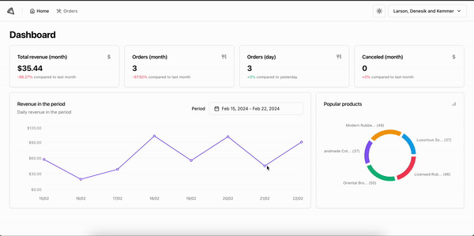
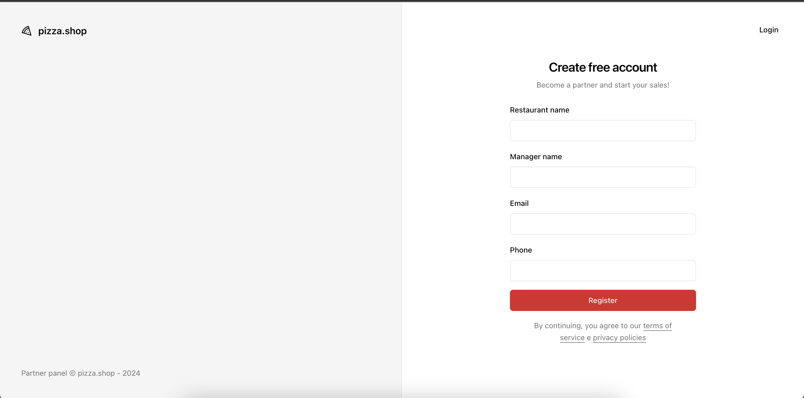
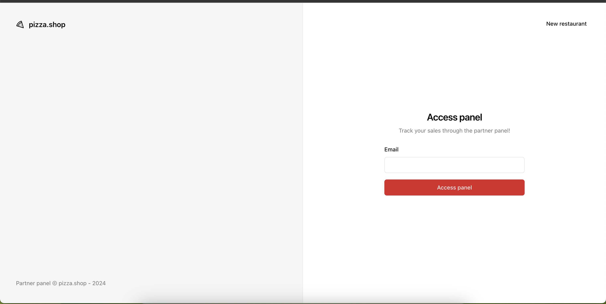
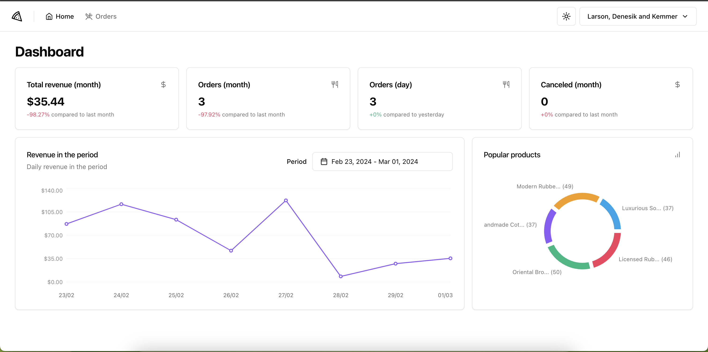
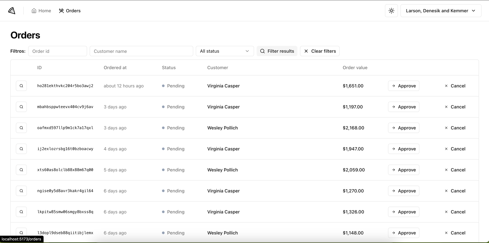
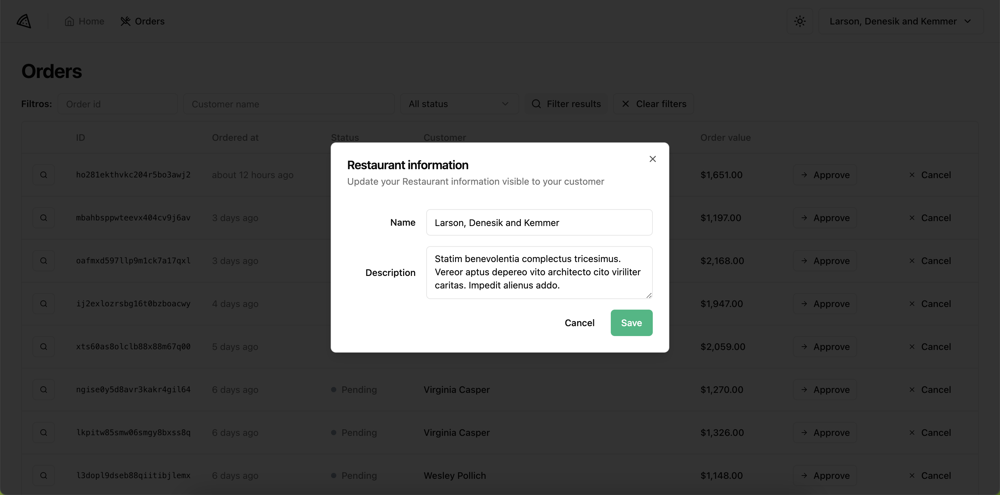

<!-- Inspired by https://github.com/jennifertakagi/REPO_NAME -->

<!-- PROJECT SHIELDS -->

[![Contributors][contributors-shield]][contributors-url]
[![Forks][forks-shield]][forks-url]
[![Stargazers][stars-shield]][stars-url]
[![Issues][issues-shield]][issues-url]
[![MIT License][license-shield]][license-url]
[![LinkedIn][linkedin-shield]][linkedin-url]

<!-- PROJECT LOGO -->
<br />
<p align="center">
  <a href="https://github.com/jennifertakagi/pizza-shop">
    
  </a>

  <h3 align="center">Pizza Shop</h3>

  <p align="center">
    Manage your Pizza shop orders with this app built with React.js and Shadcn UI 🍕
    <br />
    <a href="https://github.com/jennifertakagi/pizza-shop"><strong>Explore the docs »</strong></a>
    <br />
    <br />
    ·
    <a href="https://github.com/jennifertakagi/pizza-shop/issues">Report Bug</a>
    ·
    <a href="https://github.com/jennifertakagi/pizza-shop/issues">Request Feature</a>

  </p>
</p>

<!-- TABLE OF CONTENTS -->
<details open="open">
  <summary>Table of Contents</summary>
  <ol>
    <li>
      <a href="#about-the-project">About The Project</a>
      <ul>
        <li><a href="#built-with">Built With</a></li>
      </ul>
    </li>
    <li>
      <a href="#getting-started">Getting Started</a>
      <ul>
        <li><a href="#prerequisites">Prerequisites</a></li>
        <li><a href="#installation">Installation</a></li>
      </ul>
    </li>
    <li><a href="#usage">Usage</a></li>
    <li><a href="#roadmap">Roadmap</a></li>
    <li><a href="#contributing">Contributing</a></li>
    <li><a href="#license">License</a></li>
    <li><a href="#contact">Contact</a></li>
    <li><a href="#acknowledgements">Acknowledgements</a></li>
  </ol>
</details>

<!-- ABOUT THE PROJECT -->

## About The Project

[![Product Name Screen Shot][product-screenshot]](#)

Manage your Pizza shop orders with this app

Features:

- Register your Pizza shop
- Login in the application
- Access charts to total revenue, orders per month, orders per day and canceled per month
- Check orders and filter by status, customer and id
- Approve and Cancel orders
- Manage Pizza shop data

### Built With

- [Axios](https://github.com/axios/axios)
- [Bun](https://bun.sh/)
- [Docker](https://docs.docker.com/)
- [React](hhttps://react.dev/)
- [React Hook Form](https://react-hook-form.com/)
- [React Router DOM](https://reactrouter.com/en/main)
- [Recharts](https://recharts.org/en-US/)
- [Playwright](https://playwright.dev/)
- [TypeScript](typescriptlang.org/)

<!-- GETTING STARTED -->

## Getting Started

### Prerequisites

- npm

  ```sh
  npm install npm@latest -g
  ```

- pnpm

  ```sh
  npm install -g pnpm
  ```

- docker

### Installation

1. Clone the repo
   ```sh
   git clone https://github.com/jennifertakagi/pizza-shop.git
   ```
2. Install packages in frontend and backend folders

   ```sh
   pnpm | npm install
   ```

3. Run locally your docker

   ```sh
   docker compose up -d
   ```

4. Populate databse with the following commands

   ```sh
   bun migrate && bun seed
   ```

5. Run the following commands in the frotend folder to start the application in a development environment:
   ```sh
   pnpm run dev | npm run dev
   ```

<!-- USAGE EXAMPLES -->

## Usage

<p align="left">
   
</p>

<p align="left">
   
</p>

<p align="left">
   
</p>

<p align="left">
   
</p>

<p align="left">
   
</p>

<p align="left">
   
</p>

<!-- ROADMAP -->

## Roadmap

See the [open issues](https://github.com/jennifertakagi/pizza-shop/issues) for a list of proposed features (and known issues).

<!-- CONTRIBUTING -->

## Contributing

Contributions are what make the open source community such an amazing place to be learn, inspire, and create. Any contributions you make are **greatly appreciated**.

1. Fork the Project
2. Create your Feature Branch (`git checkout -b feature/AmazingFeature`)
3. Commit your Changes (`git commit -m 'Add some AmazingFeature'`)
4. Push to the Branch (`git push origin feature/AmazingFeature`)
5. Open a Pull Request

<!-- LICENSE -->

## License

Distributed under the MIT License. See `LICENSE` for more information.

<!-- CONTACT -->

## Contact

Jennifer Takagi - [@jennitakagi](https://twitter.com/jennitakagi)

<!-- ACKNOWLEDGEMENTS -->

## Acknowledgements

- [ESLint](https://eslint.org/)
- [Prettier](https://prettier.io/)

<!-- MARKDOWN LINKS & IMAGES -->
<!-- https://www.markdownguide.org/basic-syntax/#reference-style-links -->

[contributors-shield]: https://img.shields.io/github/contributors/jennifertakagi/worldtrip.svg?style=for-the-badge
[contributors-url]: https://github.com/jennifertakagi/pizza-shop/graphs/contributors
[forks-shield]: https://img.shields.io/github/forks/jennifertakagi/worldtrip.svg?style=for-the-badge
[forks-url]: https://github.com/jennifertakagi/pizza-shop/network/members
[stars-shield]: https://img.shields.io/github/stars/jennifertakagi/worldtrip.svg?style=for-the-badge
[stars-url]: https://github.com/jennifertakagi/pizza-shop/stargazers
[issues-shield]: https://img.shields.io/github/issues/jennifertakagi/worldtrip.svg?style=for-the-badge
[issues-url]: https://github.com/jennifertakagi/pizza-shop/issues
[license-shield]: https://img.shields.io/github/license/jennifertakagi/worldtrip.svg?style=for-the-badge
[license-url]: https://github.com/jennifertakagi/pizza-shop/blob/master/LICENSE.txt
[linkedin-shield]: https://img.shields.io/badge/-LinkedIn-black.svg?style=for-the-badge&logo=linkedin&colorB=555
[linkedin-url]: https://linkedin.com/in/jennifertakagi
[product-screenshot]: docs/homepage.png
